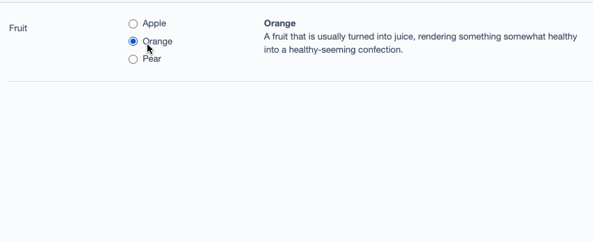

Silverstripe CMS Verbose Fields
===============================

This is an addon for Silverstripe CMS that provides some custom field types providing more room to describe the options. It is designed only for use with the admin UI.

Right now, only VerboseOptionsetField is implemented, but I'd welcome contributions of a VerboseCheckboxSetField.



Status
------

**Experimental.** This module has been freshly rolled out of some project code, and is yet to get its 2nd implementation. If you successfully use this on a project, please let me know!

Usage
-----

First, install the module. For now, you'll need to pull dev-master

```
> composer require sminnee/silverstripe-verbosefields:dev-master
```

The field is used much like an OptionsetField. `setSourceDescriptions()` lets you specify a map of HTML descriptions for each item.

```php
use Sminnee\VerboseFields\VerboseOptionsetField;

// ...

function getCMSFields() {
    $fields = parent::getCMSFields();

    $descriptions = [
        'Apple' => '<b>Apple</b><p>A delicious fruit and also a hardware manufacturerer.<p><p></p>',
        'Orange' => '<b>Orange</b><p>A fruit that is usually turned into juice, rendering something somewhat healthy into a healthy-seeming confection.</p>',
        'Pear' => '<b>Pear</b><p>A ripe pear is an excellent choice for when your hands are too clean and need to be stickier.</p>',
    ];

    $source = [
        'Apple' => 'Apple',
        'Orange' => 'Orange',
        'Pear' => 'Pear',
    ];

    $fields->addFieldToTab(
        'Root.Tab',
        (new VerboseOptionsetField('Fruit', 'Fruit'))
            ->setSource($source)
            ->setSourceDescriptions($descriptions);
}
```

Contribution
------------

Pull requests are loved! Issues are tolerated.